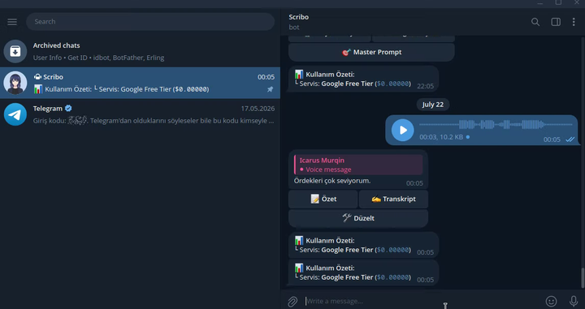

# Scribo 🎙️ (Go / Golang Edition)

<p align="center">
  
</p>

> **Scribo is a high-performance, ultra-lightweight Telegram bot written in Go (Golang). It captures voice notes, MP3s, and audio files, processing them natively using Google Gemini AI (Free Tier) with an interactive OpenRouter fallback. Runs 24/7 on VPS environments consuming under 10 MB RAM.**

[](LICENSE)
[](#)
[](#)
[](#)

---

## ⚡ Performance Highlights (Go Architecture)

- **Memory Footprint:** **~6-10 MB RAM** (vs ~60 MB in Python runtime).
- **Binary Size:** **~6.3 MB** standalone static binary. Zero runtime dependencies.
- **Startup Speed:** Instant startup (<10ms local init) with zero cold-starts and high-concurrency Goroutines.
- **Portless & SSL-Free:** Uses 100% Outbound Telegram Long Polling (no domain, no SSL, no open ports needed).

---

## 📸 Screenshots & Demo

<p align="center">
  
</p>

---

## ✨ Features

- **🆓 Google Free Tier First Strategy:** Direct connection to official Google Gemini API ($0.00). If rate limits occur, interactively prompts the user for OpenRouter fallback.
- **🎙️ Native Audio Processing:** Streams raw audio buffers directly to Gemini's multi-modal audio engine. Supports Voice Notes (`.ogg`), Audio (`.mp3`, `.m4a`, `.wav`, `.aac`, `.flac`), and Document audio files up to 20 MB.
- **📋 Tap-to-Copy Output Formatting:** Formats AI summaries and transcripts in Telegram `<pre>` code blocks for instant 1-tap clipboard copying on mobile and desktop clients.
- **🧩 100% JSON-Driven Modes (`modes.json`):** Prompt instructions and Telegram inline keyboard buttons are managed dynamically via JSON without recompiling code!
- **⚡ Real-Time Chat Action Indicator:** Sends real-time "typing..." status while downloading audio and generating AI responses.
- **🔒 Data Privacy Transparency:** Explicitly outlines data privacy differences between Google Free Tier ($0 - data used to improve Google products) vs Paid/OpenRouter ($ - strict data privacy, no model training).
- **📦 Zero-Code Multi-Arch Distribution:** Ready-to-run release archives for Linux (`amd64`, `arm64`), Windows (`amd64`, `arm64`), and macOS (`Intel amd64`, `Apple Silicon M1-M4 arm64`).

---

## 🚀 Quick Start for End-Users (Zero-Code)

Non-developers can run Scribo without installing Go or compiling code:

1. Download the pre-compiled release archive for your server architecture (`linux-amd64`, `linux-arm64`, `windows-amd64`, `windows-arm64`, `darwin-amd64`, or `darwin-arm64`).
2. Extract and enter the directory:
   - **Linux / macOS:**
     ```bash
     tar -xzvf scribo-darwin-arm64.tar.gz  # or scribo-linux-amd64.tar.gz
     cd scribo
     ```
   - **Windows:** Extract `scribo-windows-amd64.zip`.
   - **Android (Termux):**
     ```bash
     tar -xzvf scribo-linux-arm64.tar.gz
     cd scribo
     ./scribo
     ```
3. Edit your API keys in `.env`:
   ```bash
   nano .env
   ```
4. Run:
   - **Linux Systemd Service (7/24 background):**
     ```bash
     sudo ./setup_service.sh
     ```
   - **Android / Termux:**
     ```bash
     ./scribo
     ```

---

## ⚙️ Environment Configuration (`.env`)

```env
# Telegram Bot Token (from @BotFather)
TELEGRAM_TOKEN=123456789:ABCdefGHIjklMNOpqrsTUVwxyz

# Authorized Telegram User ID (from @userinfobot)
ALLOWED_USER_ID=123456789

# AI Provider API Keys
GEMINI_API_KEY=your_google_ai_studio_api_key
OPENROUTER_API_KEY=your_openrouter_api_key

# Default Provider (google or openrouter)
DEFAULT_PROVIDER=google

# Models
GOOGLE_MODEL=gemini-3.6-flash
OPENROUTER_MODEL=google/gemini-3.6-flash

# Worker Pool Concurrency Limit (Maximum simultaneous audio processing jobs)
# Controls how many audio files are processed in parallel. Extra requests wait in queue safely.
MAX_CONCURRENT_JOBS=5
```

---

## 🔒 Data Privacy & Model Training Notice

Please review Google AI Studio's terms regarding data privacy between Free Tier and Paid Tier providers:

| Provider / Tier | Cost | Model Training Usage | Rate Limits |
| :--- | :--- | :--- | :--- |
| **Google Free Tier (`google`)** | **$0.00** | ⚠️ **Yes** (Google may use anonymized data to train/improve products) | 15 RPM / 1,500 RPD |
| **OpenRouter (`openrouter`)** | **Paid** | 🛡️ **No** (Data is strictly private, no model training) | High / Uncapped |
| **Google Paid Tier** | **Paid** | 🛡️ **No** (Enterprise privacy, no model training) | High / Uncapped |

> 💡 **Recommendation:** If you process sensitive or confidential audio, set `DEFAULT_PROVIDER=openrouter` or upgrade to Google's Paid Tier to guarantee enterprise-grade data privacy.

---

## 🧩 Custom Modes & Prompts (`modes.json`)

To customize button names or add custom AI prompts, create a `modes.json` file in the working directory (or copy `modes.example.json`):

```json
{
  "tldr": {
    "label": "📝 Özet",
    "prompt": "Sen profesyonel bir ses analiz asistanısın..."
  },
  "trans": {
    "label": "✍️ Transkript",
    "prompt": "Sen hassas bir ses deşifre sistemisin..."
  },
  "fix": {
    "label": "🛠️ Düzelt",
    "prompt": "Sen uzman bir editör ve dil düzeltme sistemisin..."
  }
}
```

Scribo automatically detects `modes.json` at startup, re-creates the Telegram inline keyboard dynamically with alphabetical custom mode sorting, and applies your custom prompts!

---

## 🛠️ Developer Commands

### Test Codebase
```bash
make test
```

### Build Binary Locally
```bash
make build
```

### Build Multi-Platform Binaries
```bash
make build-linux-amd64
make build-linux-arm64
make build-windows-amd64
make build-windows-arm64
make build-darwin-amd64
make build-darwin-arm64
```

### Build Release Archives
```bash
make release
# Generates release packages in dist/ directory (tar.gz & zip)
```

---

## 📊 Monitoring Logs (Systemd)

```bash
# Follow live logs
sudo journalctl -u scribo -f

# View last 50 log entries
sudo journalctl -u scribo -n 50 --no-pager
```

---

## 📄 License

Licensed under the terms of the **MIT License**. See [LICENSE](LICENSE) for details.
