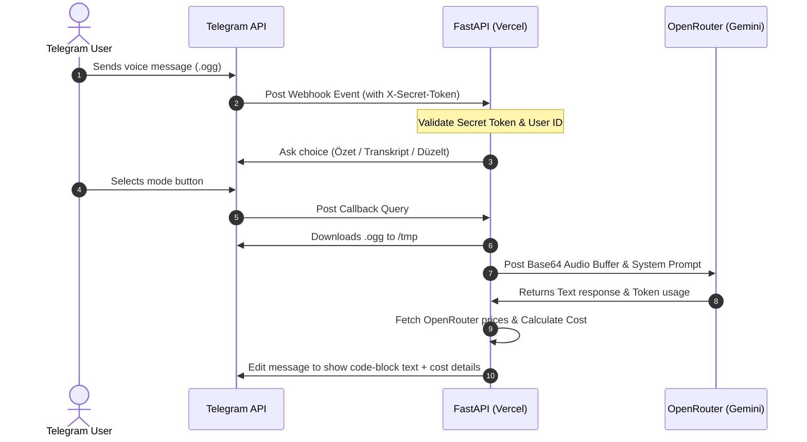

# Telegram Voice TL;DR Bot (tldr-bot) 🎙️

<p align="center">
  
</p>

> **A serverless, FastAPI-powered Telegram bot running on Vercel that intercepts voice messages, transcribes or summarizes them using Gemini 3.5 Flash (via OpenRouter audio modality), and audits execution costs in real-time.**

[](LICENSE)
[](#)
[](#)
[](#)
[](#)

---

## ✨ Features

- **⚡ Serverless FastAPI Webhook:** Built for serverless deployment on Vercel (`api/index.py`), executing instantly with zero persistent container overhead.
- **🎙️ Direct Audio Modality:** Bypasses conventional, slow speech-to-text converters. Encodes raw `.ogg` voice buffers to base64 and streams them directly to Gemini 3.5 Flash's native audio-sensing model.
- **🏷️ Smart Interactive Modes:** Features inline button selectors situated directly inside Telegram chats:
  - **📝 Özet (TL;DR):** Generates a concise, 1st-person Turkish summary without intro/outro text, keeping the context clean.
  - **✍️ Transkript:** Resolves a precise, word-for-word literal translation/transcription of the spoken recording.
  - **🛠️ Düzelt:** Transcribes the audio while correcting syntax, spelling errors, and outputting a highly fluent, reading-friendly block.
  - **📓 Obsidian Notu:** Creates a copy-paste ready structured Obsidian note (title, tags, summary, bullet points, task checklist).
  - **📅 Takvim Raporu:** Detects events, meetings, and dates to automatically generate a direct Google Calendar add link button.

---

## 🏗️ Execution Flow



---

## 🛠️ Environment Variables Configuration

Create a local `.env` file (or set keys inside your Vercel deployment console):

```env
TELEGRAM_TOKEN=your_telegram_bot_token
OPENROUTER_API_KEY=your_openrouter_developer_api_key
WEBHOOK_SECRET=your_custom_secure_secret_token
ALLOWED_USER_ID=your_numerical_telegram_user_id
```

---

## 🚀 Build & Deployment

### 1. Running Locally
To launch a local development server for testing:
```bash
# Clone the repository
git clone https://github.com/Murqin/tldr-bot.git
cd tldr-bot

# Install requirements
pip install -r requirements.txt

# Launch FastAPI using Uvicorn
uvicorn api.index:app --reload
```

### 2. Register Telegram Webhook
Point Telegram's API endpoint to your hosted server instance:
```bash
curl -X POST "https://api.telegram.org/bot<YOUR_TELEGRAM_TOKEN>/setWebhook" \
     -H "Content-Type: application/json" \
     -d '{"url": "https://your-app.vercel.app/webhook", "secret_token": "<YOUR_WEBHOOK_SECRET>"}'
```

### 3. Deploying to Vercel
Deploy seamlessly using the Vercel CLI:
```bash
# Install Vercel CLI
npm install -g vercel

# Deploy production build
vercel --prod
```

---

## 📂 Project Architecture

```text
tldr-bot/
├── api/
│   └── index.py            # Primary FastAPI entry point & bot controller
├── requirements.txt         # Python package dependencies
├── vercel.json              # Vercel serverless routing configuration
└── README.md
```

---

## 📄 License

Licensed under the terms of the MIT License. See [LICENSE](LICENSE) for more details.
