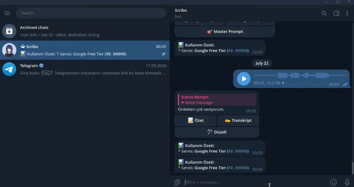

# Scribo 🎙️ (Go / Golang Sürümü)

<p align="center">
  
</p>

> **Scribo, Go ile yazılmış yüksek başarımlı ve son derece hafif bir Telegram botudur. Sesli notları, MP3'leri, ses dosyalarını ve videoları alır; bunları Google Gemini AI (Ücretsiz Katman) ile doğrudan işler, gerektiğinde OpenRouter'a düşmeyi size sorar. VPS'te, ev sunucusunda ya da konteynerde 10 MB'ın altında bellekle 7/24 çalışır.**

[](LICENSE)
[](#)
[](#)
[](#)
[](https://github.com/Murqin/Scribo/pkgs/container/scribo)

**🌍 Dil:** [English](README.md) · **Türkçe**

---

## ⚡ Performans (Go Mimarisi)

- **Bellek Kullanımı:** **~6-10 MB RAM** (Python çalışma zamanında ~60 MB).
- **İkili Dosya Boyutu:** **~6.6 MB** tek parça statik ikili. Çalışma zamanı bağımlılığı yok.
- **Başlangıç Hızı:** Anında açılış (<10 ms yerel kurulum), soğuk başlangıç yok, eşzamanlılık goroutine'lerle.
- **Portsuz ve SSL'siz:** %100 giden yönlü Telegram long polling kullanır — alan adı, SSL sertifikası ya da açık port gerekmez.

---

## 📸 Ekran Görüntüsü

<p align="center">
  
</p>

---

## ✨ Özellikler

- **🆓 Önce Google Ücretsiz Katman:** Resmî Google Gemini API'sine doğrudan bağlanır ($0.00). Kota sınırına takılırsa OpenRouter'a düşmeyi size sorar, kendi başına ücretli çağrı yapmaz.
- **🎙️ Doğal Ses ve Video İşleme:** Ham medyayı doğrudan Gemini'nin çok kipli motoruna akıtır. Desteklenenler: sesli not (`.ogg`), ses (`.mp3`, `.m4a`, `.wav`, `.aac`, `.flac`), video ve yuvarlak video mesajı (`.mp4`, `.mov`, `.webm`, `.avi`, `.mpeg`, `.wmv`, `.flv`, `.3gp`) ve aynı dosyaların belge olarak gönderilmiş hâlleri — 20 MB'a kadar. Videoyu yalnızca Google işler; video için OpenRouter'a düşüş yoktur.
- **📋 Mod Başına Çıktı Biçimi:** Her mod çıktısının nasıl gösterileceğini kendisi bildirir — `code` (varsayılan) yanıtı Telegram `<code>` etiketine sarar, tek dokunuşla panoya kopyalanır; `markdown` modelin markdown'ını gerçek Telegram biçimlendirmesine çevirir; `plain` olduğu gibi gönderir.
- **💸 Harcama Tavanı:** Ücretli OpenRouter çağrıları için isteğe bağlı günlük ve aylık USD tavanı (`DAILY_COST_LIMIT` / `MONTHLY_COST_LIMIT`). Tavana ulaşılınca ücretli seçenek artık sunulmaz ve reddin gerekçesi hangi ayardan geldiğini söyler; kalan bütçe kullanım özetinde görünür. Sayaç açılışta geçmiş dosyasından geri yüklenir, yani botu yeniden başlatmak size taze bir hak tanımaz.
- **🗂️ Kalıcı Geçmiş ve `/son`:** Biten her çıktı bir JSONL dosyasına eklenir (`HISTORY_FILE`, varsayılan `scribo_history.jsonl`). `/son`, sohbetin en son çıktısını — kendi modunun biçimiyle — yeniden gösterir; yeniden başlatmadan sonra da çalışır. Satır başına bir JSON nesnesi; veritabanı da ek bağımlılık da yok.
- **🌍 Tam Türkçe / İngilizce Yerelleştirme:** `SCRIBO_LANG` (ya da `LANG`) hem Telegram arayüzünü hem de modele giden prompt'ları değiştirir; yani bot, Türkçe cevabı İngilizce etiketlemek yerine gerçekten seçtiğiniz dilde cevap verir. Katalog ikili dosyanın içine gömülüdür; ayarsız ya da tanınmayan bir dil Türkçeye düşer.
- **🧩 %100 JSON Tabanlı Modlar (`modes.json`):** Prompt metinleri ve Telegram satır içi klavye düğmeleri kod derlemeden, JSON üzerinden yönetilir.
- **⚡ Canlı Durum Göstergesi:** Medya indirilirken ve yanıt üretilirken Telegram'da "yazıyor..." durumunu gösterir.
- **🔒 Veri Gizliliğinde Şeffaflık:** Google Ücretsiz Katman ($0) ile ücretli/OpenRouter arasındaki gizlilik farkını açıkça yazar.
- **📦 Kod Yazmadan Çok Mimarili Dağıtım:** Linux (`amd64`, `arm64`), Windows (`amd64`, `arm64`) ve macOS (`Intel amd64`, `Apple Silicon M1-M4 arm64`) için çalışmaya hazır sürüm arşivleri.
- **🐳 Konteynere Hazır:** ~15 MB'lık çok mimarili imaj (`amd64`, `arm64`) ve CasaOS, Cosmos Cloud, Portainer, Dockge için hazır `docker-compose.yml`. Yetkisiz kullanıcıyla çalışır, port yayımlamaz, durumunu tek bir birimde tutar.

---

## 🚀 Hızlı Başlangıç (Kod Yazmadan)

Go kurmadan, derleme yapmadan çalıştırmak için:

1. Sunucunuzun mimarisine uygun hazır sürüm arşivini indirin (`linux-amd64`, `linux-arm64`, `windows-amd64`, `windows-arm64`, `darwin-amd64` ya da `darwin-arm64`).
2. Arşivi açıp dizine girin:
   - **Linux / macOS:**
     ```bash
     tar -xzvf scribo-linux-amd64.tar.gz   # ya da scribo-darwin-arm64.tar.gz
     cd scribo
     ```
   - **Windows:** `scribo-windows-amd64.zip` dosyasını çıkarın.
   - **Android (Termux):**
     ```bash
     tar -xzvf scribo-linux-arm64.tar.gz
     cd scribo
     ./scribo
     ```
3. API anahtarlarınızı `.env` dosyasına yazın:
   ```bash
   nano .env
   ```
4. Çalıştırın:
   - **Linux systemd servisi (7/24 arka planda):**
     ```bash
     sudo ./setup_service.sh
     ```
   - **Android / Termux:**
     ```bash
     ./scribo
     ```

---

## 🐳 Docker ve Ev Sunucusu Panelleri

Çok mimarili imaj (`linux/amd64`, `linux/arm64`) `main`'e her push'ta ve etiketlenen her sürümde GitHub Container Registry'ye basılır. Ne Go kurmanız ne de depoyu klonlamanız gerekir:

```
ghcr.io/murqin/scribo:latest
```

```bash
# Klonlamadan, yalnızca gereken iki dosyayı indirin
curl -O https://raw.githubusercontent.com/Murqin/Scribo/main/docker-compose.yml
curl -o .env https://raw.githubusercontent.com/Murqin/Scribo/main/.env.example

nano .env                # TELEGRAM_TOKEN, ALLOWED_USER_ID, GEMINI_API_KEY doldurun
docker compose up -d
docker compose logs -f
```

`.env` dosyası `docker compose up`tan önce var olmalı; compose ayarlarınızı oradan okuyor.

Çalışan imaj **~15 MB**, içindeki bot yine ~10 MB RAM'de duruyor.

### 🔌 Port yok, alan adı yok, ters vekil yok

Scribo Telegram'a **yalnızca giden yönlü long polling** ile ulaşır. Konteyner hiçbir port yayımlamaz ve hiçbir şey dinlemez; dolayısıyla ayarlanacak ters vekil kaydı, alt alan adı ya da sertifika yoktur. Kurulum sırasında panel sizden port veya URL isterse boş bırakın — bu bir web uygulaması değil, arka plan işçisi; web arayüzü yok.

### 💾 Kalıcı veri (`/data`)

Konteynerin çalışma dizini `/data`'dır ve saklanmaya değer her şey oraya düşer:

| Dosya | Ne işe yarar |
| :--- | :--- |
| `modes.json` | İlk çalıştırmada `SCRIBO_LANG`in seçtiği dilde yazılır. Prompt'ları ve düğmeleri değiştirmek için düzenleyip botu yeniden başlatın. |
| `scribo_history.jsonl` | `/son`un arkasındaki çıktı geçmişi ve harcama tavanının yeniden başlatmadan sonra geri yüklendiği kayıt. |

Bu birimi kaybetmek hem özel prompt'larınızı siler hem de size taze bir günlük harcama hakkı tanır; yedeklemeye dahil edin.

### 👤 Bind mount'ta dosya sahipliği (`PUID` / `PGID`)

Varsayılan adlandırılmış birimle hiçbir ayar gerekmez. Bind mount'a geçerseniz — CasaOS ve Cosmos Cloud genelde sizin yerinize bunu yapar — ana makinedeki dizinin konteynerin kullanıcısı tarafından yazılabilir olması gerekir. Ya `.env` içindeki `PUID`/`PGID` değerlerini o dizinin sahibine ayarlayın ya da dizini `chown -R 1000:1000` ile devredin. Konteyner yalnızca `/data`'yı devretmeye yetecek kadar root olarak başlar, sonra istenen kullanıcıya iner ve orada kalır.

`TZ` de `.env`e yazılır ve ayarlamaya değer: günlük harcama tavanı yerel takvim sınırında sıfırlanır, yani zaman dilimi ayarlı değilse tavanınız sizin gece yarınızda değil UTC gece yarısında sıfırlanır.

> Kurulum sırasında `PUID`, `PGID` veya `TZ` doldurmanızı isteyen paneller size **zorunlu alan değil, isteğe bağlı geçersiz kılma** gösteriyor — imaj bunları zaten `1000`, `1000` ve `UTC` olarak ayarlıyor. Boş bırakmanız sorun değil.

### 🏠 Panel başına notlar

- **CasaOS** — *Apps → Custom Install → Import*, `docker-compose.yml` içeriğini yapıştırın, ortam değişkenlerini formda doldurun. Web arayüzü portunu boş bırakın.
- **Cosmos Cloud** — *ServApps → New ServApp → Docker Compose*, aynı dosyayı yapıştırın. URL/route adımını atlayın; dinlenen bir port olmadığı için yönlendirilecek bir şey yok.
- **Portainer / Dockge** — bu depodan ya da yapıştırdığınız compose dosyasından bir stack olarak dağıtın; `.env` dosyasını da yanında yükleyin.
- **YunoHost** — YunoHost uygulamaları konteynerle değil, systemd ile paketler; dolayısıyla bunu kurabileceğiniz bir Docker uygulama kataloğu yoktur. YunoHost makinesinde uygun yol yukarıdaki systemd adımıdır (`sudo ./setup_service.sh`). Docker'ı sunucuya kendiniz kurduysanız compose dosyası yine çalışır, ama bu YunoHost'un desteklediği bir kullanım değildir.

### 🔨 İmajı kendiniz kurmak

```bash
make docker-build                 # docker build -t scribo:local .
make docker-build DOCKER=podman   # Podman yerine geçebilir
```

Yerelde kurduğunuz imajı çalıştırmak için `docker-compose.yml` içindeki `image:` satırını yorum yapıp altındaki `build:` bloğunu açın.

---

## 💬 Botu Kullanmak

| Komut | İngilizce karşılığı | Ne yapar |
| :--- | :--- | :--- |
| `/basla` | `/start` | Botun çalıştığını doğrular ve ne gönderebileceğinizi listeler. |
| `/son` | `/last` | Bu sohbetin en son çıktısını, kendi modunun biçimiyle yeniden gösterir. `HISTORY_FILE`dan okunduğu için yeniden başlatmadan sonra da çalışır. |

Her iki komut açılışta Telegram'a kaydedilir; sohbette `/` yazdığınızda açıklamalarıyla listelenirler, ezberlemeniz gerekmez.

`SCRIBO_LANG` ne olursa olsun iki ad da çalışır; dile göre değişen yalnızca botun tanıttığı addır — hem karşılama mesajında hem o menüde. Özellikle `/start` hiçbir dilde çalışmayı bırakamaz, çünkü Telegram'ın kendi Başlat düğmesi ve `t.me` derin bağlantıları onu gönderir. Takma adın `başla` değil `basla` olmasının sebebi, Telegram'ın komut adlarını `a-z`, `0-9` ve alt çizgiyle sınırlaması.

Yazılacak başka bir şey yok. Sesli not, video, video mesajı, ses dosyası — ya da bunların belge olarak gönderilmiş hâli — gönderin; Scribo `modes.json`daki modlardan oluşan bir satır içi klavye ile karşılık verir, birini seçtiğinizde medyayı işler. Telegram'ın bot API'si dosyaları 20 MB ile sınırlar.

---

## ⚙️ Ortam Yapılandırması (`.env`)

```env
# Telegram bot token'ı (@BotFather'dan)
TELEGRAM_TOKEN=123456789:ABCdefGHIjklMNOpqrsTUVwxyz

# Yetkili Telegram kullanıcı kimliği (@userinfobot'tan)
ALLOWED_USER_ID=123456789

# Yapay zekâ sağlayıcı anahtarları
GEMINI_API_KEY=google_ai_studio_anahtariniz
OPENROUTER_API_KEY=openrouter_anahtariniz

# Varsayılan sağlayıcı (google ya da openrouter)
DEFAULT_PROVIDER=google

# Modeller
GOOGLE_MODEL=gemini-3.6-flash
OPENROUTER_MODEL=google/gemini-3.6-flash

# Arayüz ve cevap dili: tr ya da en. Hem Telegram mesajlarını hem de prompt'ları
# etkiler, yani modelin hangi dilde cevap vereceğini bu belirler. Ayarsız ya da
# tanınmayan bir değer Türkçe demektir. LANG=en ./scribo de çalışır, ama bu
# dosyada SCRIBO_LANG'i tercih edin: kabuğunuz zaten LANG ihraç ediyorsa
# buradaki LANG satırı yok sayılır.
SCRIBO_LANG=tr

# Aynı anda işlenecek en fazla medya sayısı. Fazlası kuyrukta güvenle bekler.
MAX_CONCURRENT_JOBS=5

# Ücretli OpenRouter çağrıları için USD cinsinden harcama tavanı. Boş bırakılırsa
# tavan yoktur. Google Ücretsiz Katman bundan etkilenmez. Sayaçlar açılışta
# HISTORY_FILE'dan geri yüklenir, yani aynı takvim günü/ayı içinde yeniden
# başlatmaya rağmen yaşar.
DAILY_COST_LIMIT=0.50
MONTHLY_COST_LIMIT=10

# Biten çıktıların satır satır eklendiği dosya. /son'u ve harcama sayacını bu
# besler. Satırı hiç yazmazsanız varsayılan kullanılır; boş bir değer verirseniz
# hiçbir şey saklanmaz (o zaman harcama sayacı her yeniden başlatmada sıfırlanır).
HISTORY_FILE=scribo_history.jsonl
```

---

## 🔒 Veri Gizliliği ve Model Eğitimi Uyarısı

Google AI Studio'nun ücretsiz ve ücretli katmanlar arasındaki gizlilik koşullarını gözden geçirin:

| Sağlayıcı / Katman | Ücret | Model eğitiminde kullanım | Kota |
| :--- | :--- | :--- | :--- |
| **Google Ücretsiz Katman (`google`)** | **$0.00** | ⚠️ **Evet** (Google, ürünlerini geliştirmek için anonimleştirilmiş veriyi kullanabilir) | 15 RPM / 1.500 RPD |
| **OpenRouter (`openrouter`)** | **Ücretli** | 🛡️ **Hayır** (Veri tümüyle özel, model eğitimi yok) | Yüksek / sınırsız |
| **Google Ücretli Katman** | **Ücretli** | 🛡️ **Hayır** (Kurumsal gizlilik, model eğitimi yok) | Yüksek / sınırsız |

> 💡 **Öneri:** Hassas ya da gizli ses işliyorsanız `DEFAULT_PROVIDER=openrouter` yapın veya Google'ın ücretli katmanına geçin.

> ⚠️ **Yerel saklama:** Çıktılar botun çalıştığı makinede `HISTORY_FILE`a düz metin olarak da yazılır (dosya `0600` izniyle oluşturulur). Diskte hiçbir şey kalmasını istemiyorsanız `HISTORY_FILE=` değerini boş bırakın — bunun harcama sayacını da her yeniden başlatmada sıfırlayacağını unutmayın.

---

## 🧩 Özel Modlar ve Prompt'lar (`modes.json`)

Düğme adlarını değiştirmek ya da kendi prompt'larınızı eklemek için çalışma dizinine bir `modes.json` koyun (`modes.example.json`u kopyalayabilirsiniz):

```json
{
  "tldr": {
    "label": "📝 Özet",
    "prompt": "Sen profesyonel bir ses analiz asistanısın...",
    "format": "code"
  },
  "trans": {
    "label": "✍️ Transkript",
    "prompt": "Sen hassas bir ses deşifre sistemisin...",
    "format": "code"
  },
  "fix": {
    "label": "🛠️ Düzelt",
    "prompt": "Sen uzman bir editör ve dil düzeltme sistemisin...",
    "format": "code"
  },
  "blog": {
    "label": "📰 Blog",
    "prompt": "Kaydı markdown başlıklarıyla bir blog taslağına dönüştür...",
    "format": "markdown"
  }
}
```

İlk üçü yerleşik varsayılanlardır; `blog`, özel bir modun markdown gösterimini nasıl seçtiğini gösterir.

### Çıktı biçimi (`format`)

Her mod çıktısının nasıl gösterileceğini kendisi seçer. Alan isteğe bağlıdır ve `code`a düşer; yani bu alan yokken yazılmış bir `modes.json` aynen çalışmaya devam eder.

| Değer | Gösterim | Nerede iyi |
|---|---|---|
| `code` (varsayılan) | `<code>` içine sarılır — tek dokunuş tüm yanıtı kopyalar | Transkript, düzeltme, başka yere yapıştıracağınız her şey |
| `markdown` | Modelin markdown'ı Telegram biçimlendirmesine çevrilir: `**kalın**`, `*italik*`, `~~üstü çizili~~`, bağlantılar, `` `kod` ``, kod blokları. Telegram'da karşılığı olmadığı için başlıklar kalın satıra, madde imleri `•`ye dönüşür | Blog taslağı, not, düzyazı |
| `plain` | Hiç biçimlendirilmeden olduğu gibi gönderilir | İçindeki işaretlemeyi olduğu gibi okumak istediğiniz çıktı |

Scribo açılışta `modes.json` yoksa kendisi oluşturur, satır içi klavyeyi dinamik olarak yeniden kurar (özel modlar alfabetik sırayla) ve sizin prompt'larınızı uygular.

> 🌍 Üretilen `modes.json`, `SCRIBO_LANG`in seçtiği dilde yazılır. Dili sonradan değiştirirseniz, hâlâ gönderilen varsayılanla bayt bayt aynı olan bir `modes.json` kendiliğinden yeniden üretilir — yoksa arayüz dil değiştirirken prompt'lar geride kalır ve model eski dilde cevap vermeyi sürdürür. Kendi elinizle düzenlediğiniz bir `modes.json`a asla dokunulmaz: dili değiştirirken onu ya çevirin ya da silin.

---

## 🛠️ Geliştirici Komutları

### Testleri çalıştır
```bash
make test
```

### Yerelde derle
```bash
make build
```

### Çok platformlu ikili dosyalar
```bash
make build-linux-amd64
make build-linux-arm64
make build-windows-amd64
make build-windows-arm64
make build-darwin-amd64
make build-darwin-arm64
```

### Sürüm arşivleri
```bash
make release
# dist/ dizininde tar.gz ve zip paketleri üretir
```

### Konteyner imajı
```bash
make docker-build   # scribo:local imajını kurar
make docker-up      # docker compose up -d
make docker-logs    # docker compose logs -f
make docker-down    # docker compose down
```

---

## 📊 Logları İzleme

```bash
# systemd — canlı log
sudo journalctl -u scribo -f

# systemd — son 50 satır
sudo journalctl -u scribo -n 50 --no-pager

# Docker — canlı log
docker compose logs -f
```

---

## 📄 Lisans

**MIT Lisansı** ile lisanslanmıştır. Ayrıntılar için [LICENSE](LICENSE) dosyasına bakın.
